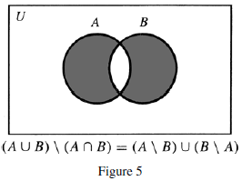
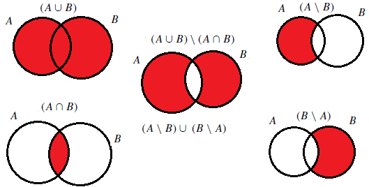
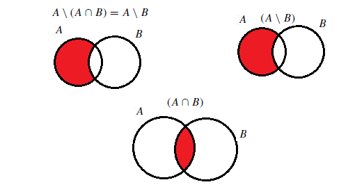
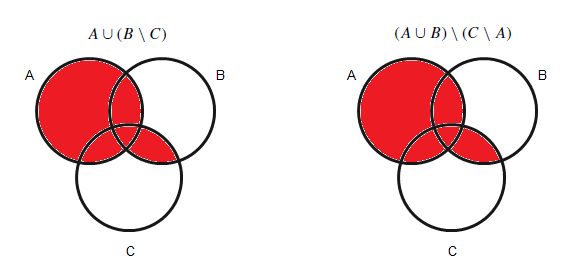

#### ∗1. Let $A = \{1, 3, 12, 35\}$, $B = \{3, 7, 12, 20\}$, and $C = \{x \mid x \text{ is a prime number}\}$. List the elements of the following sets. Are any of the sets below disjoint from any of the others? Are any of the sets below subsets of any others?

- (a) $A \cap B$. $\medspace \qquad \qquad\{3, 12\}$
- (b) $(A \cup B) \setminus C$. $\qquad \{12,20,35\}$
- (c) $A \cup (B \setminus C)$. $\qquad \{1,3,12,20,35\}$

- Are any of the sets below disjoint from any of the others?
  - No, as no intersection $x\cap y=\phi$ for (a), (b) and (c)
- Are any of the sets below subsets of any others?
  - Yes:
    - (a) $\subseteq$ (c): $\qquad A \cap B \quad \subseteq \quad A \cup (B \setminus C)$
    - (b) $\subseteq$ (c): $\qquad (A \cup B) \setminus C \quad \subseteq \quad A \cup (B \setminus C)$

#### 2. Let $A = \{\text{United States, Germany, China, Australia}\}$, $B = \{\text{Germany, France, India, Brazil}\}$, and $C = \{x \mid x\text{ is a country in Europe}\}$. List the elements of the following sets. Are any of the sets below disjoint from any of the others? Are any of the sets below subsets of any others?

- (a) $A \cup B$. $\medspace \qquad \qquad\{\text{United States, Germany, China, Australia, France, India, Brazil}\}$
- (b) $(A \cap B) \setminus C$. $\qquad \{\text{Germany}\}$
- (c) $(B \cap C) \setminus A$. $\qquad\{\text{France}\}$

- Are any of the sets below disjoint from any of the others?
  - Yes:
    - (b) $\subseteq$ (c): $\qquad \Big[(A \cap B) \setminus C\Big] \cap \Big[(B \cap C) \setminus A\Big]=\phi$
- Are any of the sets below subsets of any others?
  - Yes, both (b) and (c) are subsets of (a)

#### 3. Verify that the Venn diagrams for $(A \cup B) \setminus (A \cap B)$ and $(A \setminus B) \cup (B \setminus A)$ both look like Figure 5, as stated in this section.

#### ∗4. Use Venn diagrams to verify the following identities:

- (a) $A \setminus (A \cap B) = A \setminus B$.

    

- (b) $A \cup (B \cap C) = (A \cup B) \cap (A \cup C)$.

    

#### 5. Verify the identities in exercise 4 by writing out (using logical symbols) what it means for an object x to be an element of each set and then using logical equivalences.

$$A \setminus (A \cap B) = A \setminus B$$

$\Big(x \in A \Big)\land \neg\Big(x \in A \land x \in B\Big)$

$\Big(x \in A\Big) \land \Big(x \notin A \lor x \notin B\Big)$ (DeMorgan's law)

$\Big(x \in A \land x \notin A\Big) \lor \Big(x \in A \land x \notin B\Big)$ (Distributive property)

$\Big(x \in A \setminus A\Big) \lor \Big(x \in A \setminus B\Big)$ (Definition of $\setminus$)

$A\setminus A = \phi$, therefore

$\Big(x \in \phi\Big) \lor \Big( x \in A \setminus B\Big)$

$x \in \phi \cup \Big(A \setminus B\Big)$ (Definition of $\cup$)

Since $\phi \cup S \equiv S$ for any set $S$

$\phi \cup \Big(A \setminus B\Big)\equiv A \setminus B$

$x \in A \setminus B$

$$A \cup (B \cap C) = (A \cup B) \cap (A \cup C)$$

$x \in A \cup (B \cap C)$ is equivalent to

$x \in A \lor (x \in B \land x \in C)$ (Definitions of $\cup$, $\cap$)

$\Big(x \in A \lor x \in B\Big)\land \Big(x \in A \lor x \in C\Big)$ (Distributive law)

$\Big(x \in A \cup  B\Big)\land \Big(x \in A \cup C\Big)$ (Definition of $\cup$)

$x \in \Big(A \cup  B\Big)\cap \Big(A \cup C\Big)$ (Definition of $\cap$)
