# Chapter 1.4

#### \*1. Let $A = \{1, 3, 12, 35\}$, $B = \{3, 7, 12, 20\}$, and $C = \{x \mid x \text{ is a prime number}\}$. List the elements of the following sets. Are any of the sets below disjoint from any of the others? Are any of the sets below subsets of any others?

- (a) $A \cap B$. $\medspace \qquad \qquad\{3, 12\}$
- (b) $(A \cup B) \setminus C$. $\qquad \{12,20,35\}$
- (c) $A \cup (B \setminus C)$. $\qquad \{1,3,12,20,35\}$

- Are any of the sets below disjoint from any of the others?
  - No, as no intersection $x\cap y=\phi$ for (a), (b) and (c)
- Are any of the sets below subsets of any others?
  - Yes:
    - (a) $\subseteq$ (c): $\qquad A \cap B \quad \subseteq \quad A \cup (B \setminus C)$
    - (b) $\subseteq$ (c): $\qquad (A \cup B) \setminus C \quad \subseteq \quad A \cup (B \setminus C)$

#### 2. Let $A = \{\text{United States, Germany, China, Australia}\}$, $B = \{\text{Germany, France, India, Brazil}\}$, and $C = \{x \mid x\text{ is a country in Europe}\}$. List the elements of the following sets. Are any of the sets below disjoint from any of the others? Are any of the sets below subsets of any others?

- (a) $A \cup B$. $\medspace \qquad \qquad\{\text{United States, Germany, China, Australia, France, India, Brazil}\}$
- (b) $(A \cap B) \setminus C$. $\qquad \{\text{Germany}\}$
- (c) $(B \cap C) \setminus A$. $\qquad\{\text{France}\}$

- Are any of the sets below disjoint from any of the others?
  - Yes:
    - (b) $\subseteq$ (c): $\qquad \Big[(A \cap B) \setminus C\Big] \cap \Big[(B \cap C) \setminus A\Big]=\phi$
- Are any of the sets below subsets of any others?
  - Yes, both (b) and (c) are subsets of (a)

#### 3. Verify that the Venn diagrams for $(A \cup B) \setminus (A \cap B)$ and $(A \setminus B) \cup (B \setminus A)$ both look like Figure 5, as stated in this section.

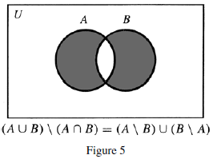
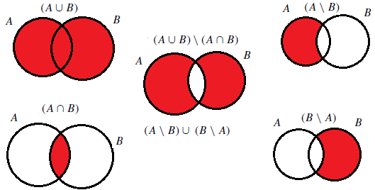

#### \*4. Use Venn diagrams to verify the following identities:

- (a) $A \setminus (A \cap B) = A \setminus B$.

    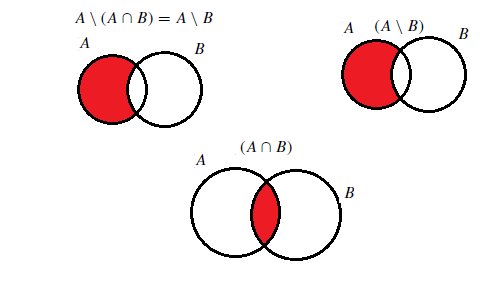

- (b) $A \cup (B \cap C) = (A \cup B) \cap (A \cup C)$.

    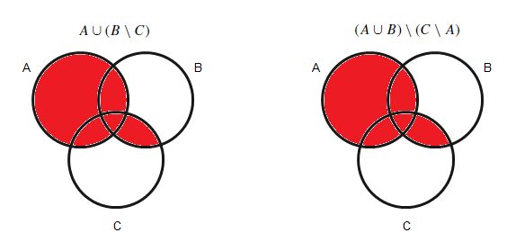

#### 5. Verify the identities in exercise 4 by writing out (using logical symbols) what it means for an object x to be an element of each set and then using logical equivalences.

$$A \setminus (A \cap B) = A \setminus B$$

$\Big(x \in A \Big)\land \neg\Big(x \in A \land x \in B\Big)$

$\Big(x \in A\Big) \land \Big(x \notin A \lor x \notin B\Big)$ (DeMorgan's law)

$\Big(x \in A \land x \notin A\Big) \lor \Big(x \in A \land x \notin B\Big)$ (Distributive property)

$\Big(x \in A \setminus A\Big) \lor \Big(x \in A \setminus B\Big)$ (Definition of $\setminus$)

$A\setminus A = \phi$, therefore

$\Big(x \in \phi\Big) \lor \Big( x \in A \setminus B\Big)$

$x \in \phi \cup \Big(A \setminus B\Big)$ (Definition of $\cup$)

Since $\phi \cup S \equiv S$ for any set $S$

$\phi \cup \Big(A \setminus B\Big)\equiv A \setminus B$

$x \in A \setminus B$

$$A \cup (B \cap C) = (A \cup B) \cap (A \cup C)$$

$x \in A \cup (B \cap C)$ is equivalent to

$x \in A \lor (x \in B \land x \in C)$ (Definitions of $\cup$, $\cap$)

$\Big(x \in A \lor x \in B\Big)\land \Big(x \in A \lor x \in C\Big)$ (Distributive law)

$\Big(x \in A \cup  B\Big)\land \Big(x \in A \cup C\Big)$ (Definition of $\cup$)

$x \in \Big(A \cup  B\Big)\cap \Big(A \cup C\Big)$ (Definition of $\cap$)

#### 6. Use Venn diagrams to verify the following identities:

- (a) $(A \cup B) \setminus C = (A \setminus C) \cup (B \setminus C)$.

    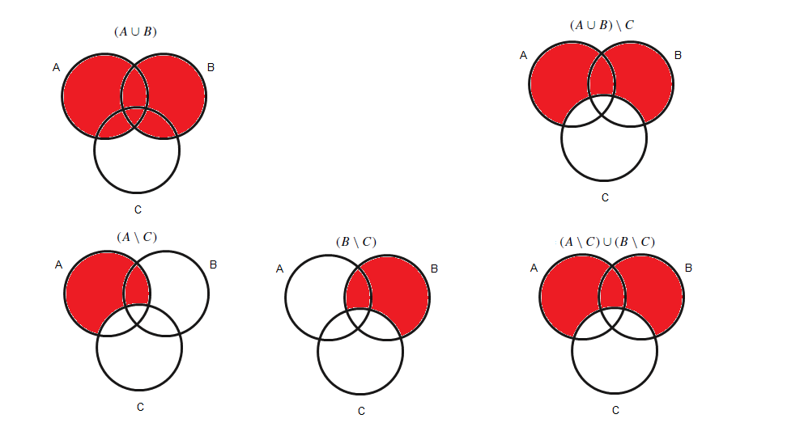

- (b) $A \cup (B \setminus C) = (A \cup B) \setminus (C \setminus A)$.

    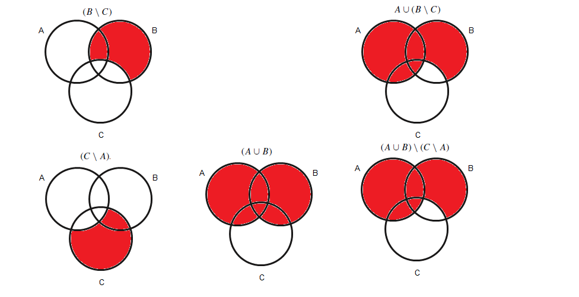

#### 7. Verify the identities in exercise 6 by writing out (using logical symbols) what it means for an object x to be an element of each set and then using logical equivalences.

$$(A \cup B) \setminus C = (A \setminus C) \cup (B \setminus C)$$

$x \in (A \cup B) \setminus C$

$\Big(x \in A \lor x \in B\Big) \land \Big(x \notin C\Big)$ (Definitions of $\cup$, $\setminus$)

$\Big(x\in A\land x \notin C\Big) \lor \Big(x\in B\land x \notin C\Big)$ (Distributive law)

$\Big(x\in A\setminus C\Big) \lor \Big(x\in B\setminus  C\Big)$ (Definition of $\setminus$)

$x \in \Big(A\setminus C\Big) \cup \Big(B\setminus  C\Big)$ (Definition of $\cup$)

$$A \cup (B \setminus C) = (A \cup B) \setminus (C \setminus A)$$

$x \in A \cup (B \setminus C)$

$x \in A \lor (x \in B \land x \notin C)$ (Definition of $\setminus$)

$\Big(x \in A \lor x \in B\Big) \land \Big(x \in A \lor x \notin C\Big)$ (Distributive law)

$\Big(x \in A \lor x \in B\Big) \land \neg\Big(x \in C \land x \notin A\Big)$ (Reverse the second statement with a DeMorgan's equivalent)

$\Big(x \in A \cup  B\Big) \land \neg\Big(x \in C \setminus A\Big)$ (Definitions of $\cup$, $\setminus$)

$\Big(x \in A \cup  B\Big) \land \Big(x \notin C \setminus A\Big)$ (Apply the $\neg$)

$x \in \Big(A \cup  B\Big) \setminus \Big( C \setminus A\Big)$ (Definition of $\setminus$)

#### \*8. For each of the following sets, write out (using logical symbols) what it means for an object $x$ to be an element of the set. Then determine which of these sets must be equal to each other by determining which statements are equivalent.

- (a) $(A \setminus B) \setminus C$. $=\Big(x\in A \land x \notin B\Big)\land x \notin C$
- (b) $A \setminus (B \setminus C)$. $=x\in A \land \Big(x\in B \land x \notin C\Big)$
- (c) $(A \setminus B) \cup (A \cap C)$. $=\Big(x\in A \land x \notin B \Big)\lor \Big(x\in A \land x \in B\Big)$
- (d) $(A \setminus B) \cap (A \setminus C)$. $=\Big(x \in A \land x \notin B \Big)\land \Big(x \in A \land x \notin C\Big)$
- (e) $A \setminus (B \cup C)$ $=x \in A \land \Big(x\in B \lor x \in C)$.

#### 9. It was shown in this section that for any sets $A$ and $B$, $(A \cup B) \setminus B \subseteq A$. Give an example of two sets $A$ and $B$ for which $(A \cup B) \setminus B \neq A$.

Our goal is to satisy the expression $(A \cup B) \setminus B \neq A$

In order for this to happen, $A\cap B \neq \phi$, the examples below illustrate this

1. Example with $A\cap B=\phi$

   Let $A=\{1,2,3,4\}\quad B=\{5,6,7,8\}$, then

   $(A \cup B) \setminus B =\{1,2,3,4\} \cup \{5,6,7,8\} \setminus\{5,6,7,8\}$

   $=\{1,2,3,4,5,6,7,8\} \setminus\{5,6,7,8\} = \{1,2,3,4\} = A$

2. Example with $A\cap B\neq\phi$

   Let $A=\{1,2,3,4\}\quad B=\{2,4,6,8\}$, then

   $(A \cup B) \setminus B =\{1,2,3,4\} \cup \{2,4,6,8\} \setminus\{2,4,6,8\}$

   $=\{1,2,3,4,6,8\} \setminus\{2,4,6,8\} = \{1,3\} \neq A$

#### \*10. It is claimed in this section that you cannot make a Venn diagram for four sets using overlapping circles.

- (a) What’s wrong with the following diagram? (Hint: Where’s the set $(A \cap D) \setminus (B \cup C)$?)

    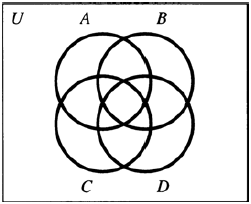

  The attempt below shows the set $(A \cap D) \setminus (B \cup C)$ cannot be displayed using circles.

    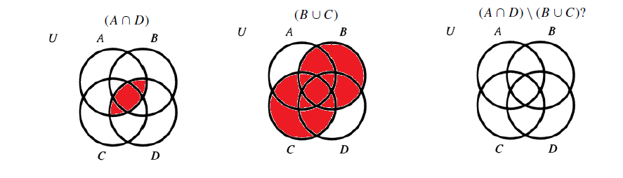

- (b) Can you make a Venn diagram for four sets using shapes other than circles?

  Yes, below is a succesful attempt of depicting $(A \cap D) \setminus (B \cup C)$ using triangles.

    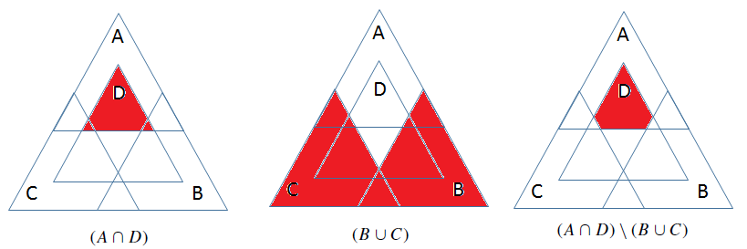

#### 11.

- (a) MakeVenn diagrams for the sets $(A \cup B)\setminus C$ and $A \cup (B \setminus C)$. What can you conclude about whether one of these sets is necessarily a subset of the other?

    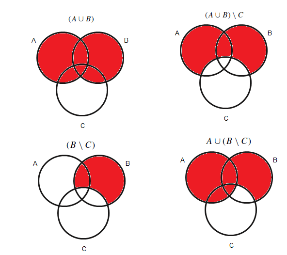

  $(A \cup B)\setminus C \subseteq A \cup (B \setminus C)$

- (b) Give an example of sets $A$, $B$, and $C$ for which $(A \cup B) \setminus C \neq A \cup (B \setminus C)$.

  If there is an element $x$ such that $x \in A$, $x\in B$ and $x\in C$, the equation $(A \cup B) \setminus C \neq A \cup (B \setminus C$ will be satisfied.

  In an elementwise notation, this is expressed as:

  $(A \cup B) \setminus C \neq A \cup (B \setminus C$ for $y \in \{x |x\in A\cap B \cap C\}$

  Let $A=\{1,2,3\}$, $B=\{3,4,5\}$, $C=\{3, 10\}$, then

  $(A \cup B) \setminus C \neq A \cup (B \setminus C)$ becomes

  $(\{1,2,3\} \cup \{3,4,5\}) \setminus \{3,10\} \neq \{1,2,3\} \cup (\{3,4,5\} \setminus \{3,10\})$

  $\{1,2,3,4,5\} \setminus \{3,10\} \neq \{1,2,3\} \cup \{4,5\}$

  $\{1,2,4,5\} \neq \{1,2,3,4,5\}$

#### \*12. Use Venn diagrams to show that the associative law holds for symmetric difference; that is, for any sets $A$, $B$, and $C$, $A \triangle (B\triangle C) = (A \triangle B) \triangle C$.

Recalling the symmetric difference equation:

$$A\triangle B = (A\setminus B)\cup(B\setminus A) = (A\cup B) \setminus (A \cap B)$$

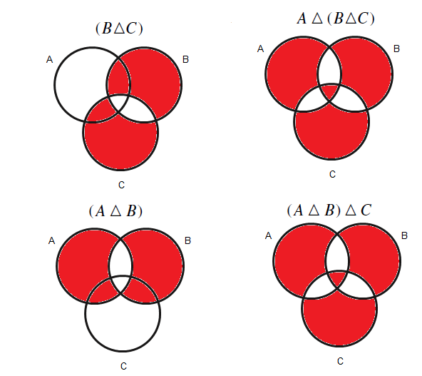
