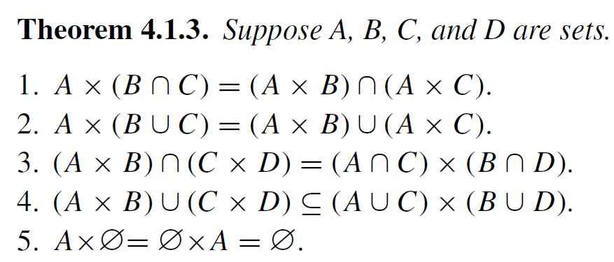

### \*1. What are the truth sets of the following statements? List a few elements of each truth set.

- (a) "$x$ is a parent of $y$", where $x$ and $y$ both range over the set $P$ of all people.

  Let $C(x,y)$ be the statement "$x$ is a parent of $y$". The truth set would be $\{(x,y)\in P \times P\}=\{(x,y)\in P^2\}$

- (b) "There is someone who lives in $x$ and attends $y$" where $x$ ranges over the set $C$ of all cities and $y$ ranges over the set $U$ of all universities.

  $\{x,y\in C\times U\}$

### \*4. Let $A=\{1,2,3\}$, $B=\{1,4\}$, $C=\{3,4\}$, and $D=\{5\}$. Compute all the sets mentioned in Theorem 4.1.3 and verify that all parts of the theorem are true.

Reference

1. $\{1,2,3\}\times (\{1,4\} \cap \{3,4\})=(\{1,2,3\} \times \{1,4\})\cap(\{1,2,3\} \times \{3,4\})$

   $\{1,2,3\}\times \{4\}=\{(1,1), (1,4), (2,1), (2,4), (3,1), (3,4)\}\cap\{(1,3), (1,4), (2,3), (2,4), (3,3), (3,4)\}$

   $\{(1,4), (2,4), (3,4)\}=\{(1,4), (2,4), (3,4)\}$ $\quad \checkmark$

2. $\{1,2,3\}\times (\{1,4\} \cup \{3,4\})=(\{1,2,3\} \times \{1,4\})\cup(\{1,2,3\} \times \{3,4\})$

   $\{1,2,3\}\times \{1,3,4\}=\{(1,1), (1,4), (2,1), (2,4), (3,1), (3,4)\}\cup\{(1,3), (1,4), (2,3), (2,4), (3,3), (3,4)\}$

   $\{(1,1), (1,3), (1,4), (2,1), (2,3), (2,4), (3,1), (3,3), (3,4)\}=\{(1,1), (1,4), (2,1), (2,4), (3,1), (3,4), (1,3), (2,3), (3,3)\}$ $\quad \checkmark$

3. $(\{1,2,3\}\times \{1,4\})\cap(\{3,4\} \times \{5\}) = (\{1,2,3\} \cap \{3,4\}) \times (\{1,4\} \times  \{5\})$

   $\{(1,1), (1,4), (2,1), (2,4), (3,1), (3,4)\}\cap(\{(3,5), (4,5)\}) = \{3\} \times \{\}$

   $\varnothing = \varnothing$

4. $(\{1,2,3\}\times \{1,4\})\cup(\{3,4\} \times \{5\}) \subseteq (\{1,2,3\} \cup \{3,4\}) \times (\{1,4\} \cup  \{5\})$

   $\{(1,1), (1,4), (2,1), (2,4), (3,1), (3,4)\}\cup(\{(3,5), (4,5)\}) = \{1,2,3,4\} \times \{1,4,5\}$

   $\{(1,1), (1,4), (2,1), (2,4), (3,1), (3,4), (3,5), (4,5)\} = \{(1,1),(1,4),(2,1), (2,4), (3,1), (3,4),(3,5), (4,5), (1,5), (2,5)\}$

5. $\{1,2,3\} \times \{\} = \{\} \times \{1,2,3\} = \{\}$

### \*6. What’s wrong with the following proof that for any sets $A$, $B$, $C$, and $D$, $(A \cup C) \times (B \cup D) \subseteq (A \times B) \cup (C \times D)$? (Note that this is the reverseof the inclusion in part 4 of Theorem 4.1.3.)

_Proof_. Suppose $(x, y) \in (A \cup C) \times (B \cup D)$. Then $x \in A \cup C$ and $y \in
B \cup D$, so either $x \in A$ or $x \in C$, and either $y \in B$ or $y \in D$. We consider
these cases separately.

Case 1. $x \in A$ and $y \in B$. Then $(x, y) \in A \times B$.

Case 2. $x \in C$ and $y \in D$. Then $(x, y) \in C \times D$.

Thus, either $(x, y) \in A \times B$ or $(x, y) \in C \times D$, so $(x, y) \in (A \times B) \cup (C \times D)$. $\square$

The cases are not exhaustive, it needs two more cases to be correct:

Case 3. $x \in A$ and $y \in D$. Then $(x, y) \in A \times D$.

Case 4. $x \in C$ and $y \in B$. Then $(x, y) \in C \times B$.

### \*8. Is it true that for any sets $A$, $B$, and $C$, $A \times (B \setminus C) = (A \times B) \setminus (A \times C)$? Give either a proof or a counterexample to justify your answer.

($\longrightarrow$) Suppose $(x,y) \in  A \times (B \setminus C)$, it follows that $x \in A$ and $y \in B \land y \notin C$. Since $x \in A$ and $y \in B$, we can determine that $(x,y) \in A \times B$, and since $y \notin C$, it follows that $(x,y) \notin A \times C$. Therefore, $(x, y) \in (A \times B) \setminus (A \times C)$.

($\longleftarrow$) Suppose $(x, y) \in (A \times B) \setminus (A \times C)$. It follows that $(x,y) \in A \times B$ and $(x,y) \notin A \times C$. Then, we have that $x \in A$, $y \in B$ and $y \notin C$. Thus, $(x,y) \in A \times (B \setminus C)$.
